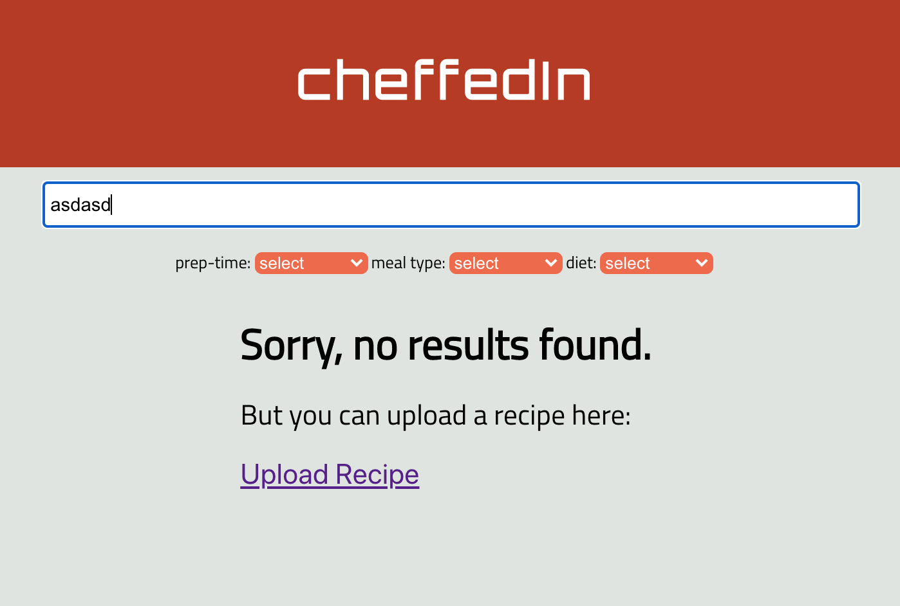
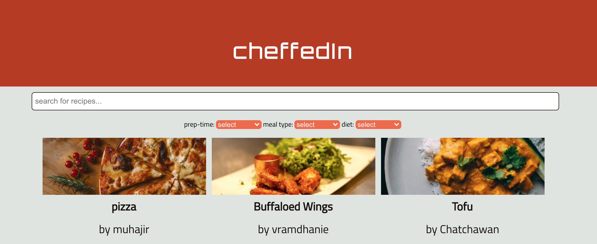
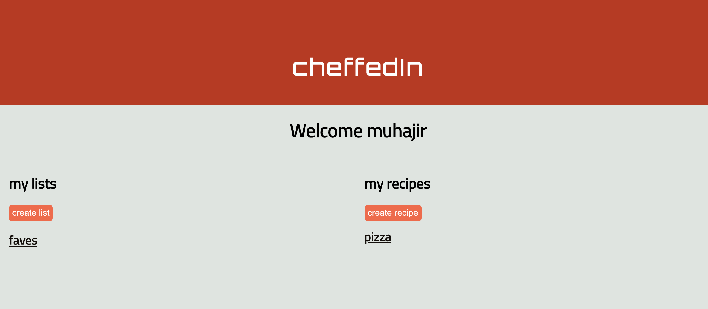
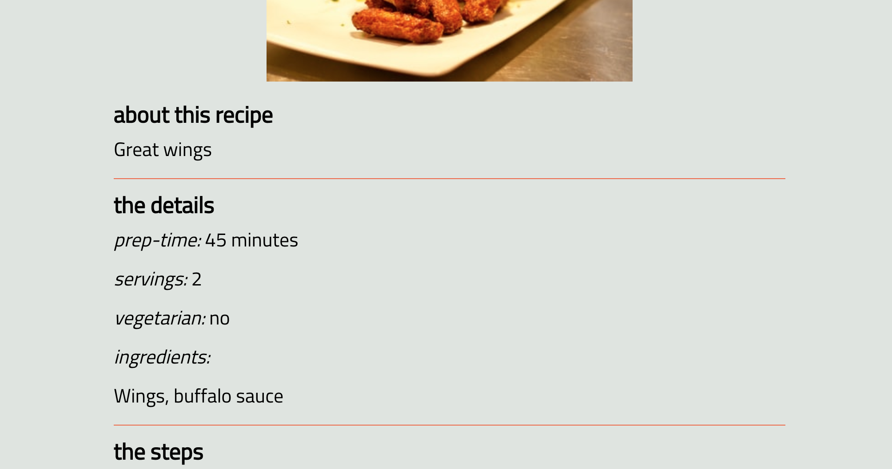
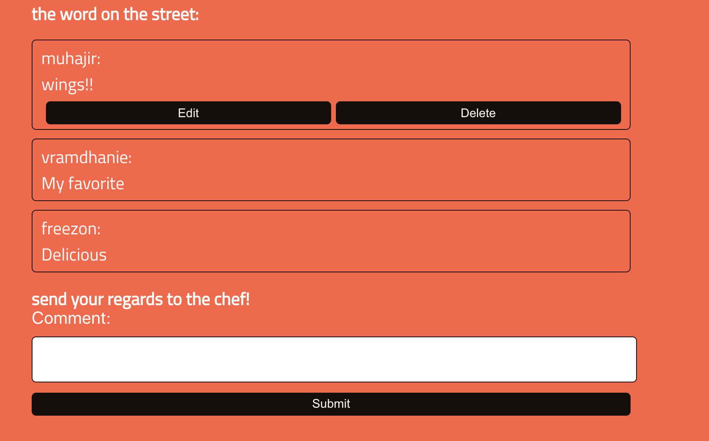

# cheffedIn

(https://cheffedin.vercel.app/)

## Summary

This app was built during COVID-19, a time which saw more people staying at home, as well as making more meals at home and experimenting with more varieties of cooking. This app is designed to allow users to share their recipes with others, search for recipes uploaded by other users, save recipes from other users to their own lists so that they can try them later, and interact with other users through commenting on recipes.

This project was built utilizing Javascript/CSS & React/JSX for the front end client. For the back end, express.js and Node.js were utilized to architect the REST API, with postgreSQL for the database. It was designed mobile-first.

The client is deployed to Vercel, and the server and database are deployed to Heroku. 

Basic smoke testing has been added to the React components, and HTTP integration testing was implemented using Mocha and Chai. User authentication was implemented using JWT tokens, and passwords were encrypted using bcrypt with 256 encryption and a salt of 10. The XSS library was also implemented for basic security, to sanitize and prevent cross-site scripting

The Formik library was researched and implemented for the majority of forms on the site, and a simple implementation of the Unsplash API was included in the create recipe form, to demonstrate the ability to learn and work with 3rd party API's. 

Backend code can be viewed here (https://github.com/M-Sayer/Capstone-API)

*see API documentation below*

# 

# 

# 

# 

# 

API Documentation:

### RECIPES

  #### /recipes
    GET - returns json data about all recipes
      success response 
      code 200 & sanitized recipes data

    POST - posts new recipe data to recipe table containing all recipes // auth required
      success response 
      code 201 && sanitized recipe data

      error response
      code 400 & { error: 'Missing {value missing} in request body }

  #### /recipes/:recipe_id
    GET - returns json data about a single recipe // auth required
      success response
      code 200 & sanitized recipe data
      
    PATCH - edits data for specified recipe // auth required
      success response
      code 204

    DELETE - deletes specified recipe // auth required
      success response
      code 204

  #### /recipes/:recipe_id/comments
    GET - returns json data containing all comments for specified recipe
      success response
      code 200 & sanitized comments

### COMMENTS

  #### /comments
    POST - posts new comment to comments table // auth required
      success response
      code 201 && sanitized comment

      error response
      code 400 & { error: 'Missing {value missing} in request body }

  #### /comments/:comment_id
    DELETE - deletes specified comment // auth required
      succes response
      code 204

    PATCH - edits data for specified comment // auth required
      success response
      code 204

      error response
      code 400 & { error: 'Missing {value missing} in request body }

### LOGIN

  #### /login
    POST - posts login data to be verified
      success response
      code 200 & JWT auth token

      error response
      code 401 && { error: 'missing credentials' }

      OR

      code 401 && { error: 'invalid credentials' }

### REGISTER

  #### /register
    POST - posts data to user table with encrypted password if successful
      success response
      code 200 & JWT auth token

      error response
      code 400 & { error: 'Missing {value missing} in request body }

      OR 

      code 401 && { error: 'username unavailable' }

      OR

      code 401 && { error: 'email already in use' }

### USERS

  #### /users/:user_id/lists
    GET - returns json data for all lists created by associated user // auth required
      succes response
      code 200 & sanitized lists

      error response
      code 404 & { error: 'no lists found' }

  #### /users/:user_id/recipes
    GET - returns json data for all recipes created by associated user // auth required
      success response
      code 200 & sanitized recipes

      error response
      code 404 & { error: 'no recipes found' }

### LISTS

  #### /lists
    POST - posts new list to lists table // auth required
      success response
      code 201 & sanitized list

      error response
      code 400 & { error: 'Missing {value missing} in request body }

  #### /lists/:list_id
    GET - returns json data for specified list // auth required
      success response
      code 200 & sanitized list

      error response
      code 500 & { error: 'something went wrong, please try again later' }
    
    DELETE - deletes specified list from lists table // auth required
      succes response
      code 204

    PATCH = edits data for specified list // auth required
      succes response
      code 204

  #### /lists/:list_id/recipes
    GET - returns json data for all recipes associated with given list (many to many table) // auth   
      required
        success response
        code 200 & sanitized recipes

        error response
        code 404 & { error; 'no recipes found' }

  #### /lists/:list_id/recipes/:recipe_id
    DELETE - deletes list_id/recipe_id pair from junction table (removes recipe from list) // auth required
      success response
      code 204

      error response
      code 404 & { error: 'not found' }

    POST - creates new list_id/recipe_id in junction table (adds recipe to list) // auth required
      succes response
      code 200

      error response
      code 400 & { error: 'Missing {value missing} in request body }

      OR

      code 404 & { error; 'list not found' }

      OR 

      code 409 & { error: 'Recipe already in list' }
      

    